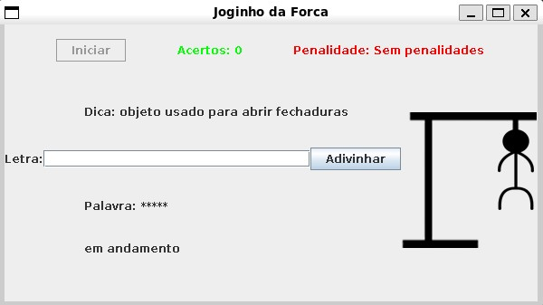

# jogo da forca

## Projeto Acadêmico

Um projeto acadêmico feito pelos alunos [Artur da Silva Souza](https://ifpb.github.io/projects/people/202514320010/) e [Érik Jonatha Albuquerque de Sena](https://ifpb.github.io/projects/people/20242370008/) para a disciplina de Programação Orientada a Objetos, do curso Bacharelado em Engenharia de Software do IFPB.

O objetivo desse projeto é testar nosso aprendizado em POO desenvolvendo um jogo em java com interface gráfica utilizando a biblioteca Swing.


## Sobre o jogo





 - Em cada rodada, o jogador terá que adivinhar uma nova palavra, tendo apenas uma dica para lhe ajudar.
 - Ao errar, chutando uma letra que não tenha na palavra, o boneco que fica enforcado à direita irá perder 1 membro, até que não sobre mais nenhum...
 - Se o boneco perder todos os membros, não sobrando nada, o jogador perde.
 - Se o jogador conseguir adivinhar todas as letras da palavra, ele ganha.
 - Ao fim de cada rodada, o botão iniciar é liberado, permitindo que o jogador possa iniciar uma nova rodada.


## Como rodar o projeto

### Requisitos:

 - Java 25 ou superior


### Executando:

Para executar, abra o terminal, acesse o diretório src/ e siga os passos abaixo:


#### 1. Compilar as classes

```
javac *.java
```

#### 2. Executar 

```
java TelaJogo
```

Caso queira juntar todos os arquivos do jogo dentro de um único arquivo executável apenas, você pode executar o seguinte comando no terminal, após realizar o passo 1:

#### Compactar o jogo dentro de um .jar

```
jar cvfe jogo_da_forca.jar TelaJogo *.class imagens/ dados/
```

E executar esse arquivo com o comando abaixo:

```
java -jar jogo_da_forca.jar
```

Esse arquivo .jar pode ser executado em qualquer máquina que tenha java 25+